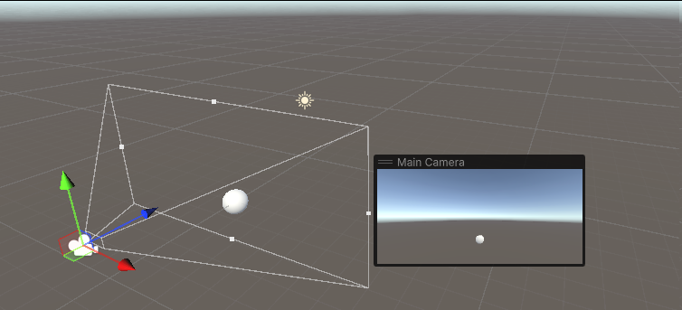

## Mundos virtuales. Introducción a la programación de gráficos 3D.

1. Qué funciones se pueden usar en los scripts de Unity para llevar a cabo traslaciones, rotaciones y escalados.
    
    Para mover un objeto:
    Lo hacemos en cualquiera de sus tres ejes con la propiedad **`Translate`**
    `Vector3 movimiento = new Vector3(3, 0.0f, 2);
     transform.translate(movimiento * Time.deltaTime * velocidad);`
    En **`movimiento`** almacenamos la nueva posición, **`deltaTime`** calcula el tiempo necesario para alcanzar la nueva posición, y `**velocidad**` es la velocidad a la que nos movemos.
    Para rotar un objeto: 
    `transform.Rotate(Vector3.up * velocidad * Time.deltaTime);`
    Para escalar un objeto:
    Se usa el atributo **`localScale`**, que sirve para modificar las dimensiones de un objeto.
    `transform.localScale += new Vector3(x, y, z);`
    
2. Crea una escena básica con un plano y 2 esferas posicionadas en el centro de la escena. Una de ellas debe ser de radio 1 y la otra 0,1. ¿Cómo duplicarías el tamaño de la esfera de radio 1 en el editor?. ¿Cómo duplicarías el tamaño mediante un script?
En el editor iría a la componente Scale del Transform y la aumentaría de manera proporcional en las 3 dimensiones (x, y, z).
    
    Es necesario recurrir al parámetro `Transform.localScale`. En concreto, lo necesario es cambiar el componente por el doble de su valor base.
    `transform.scale = new Vector3(
        transform.scale.x, 
        transform.scale.y, 
        transform.scale.z) * 2;`****
    
3. Qué instrucción incluirías en un script que sitúe la esfera de radio 1 en la posición (3,5,1). Cómo la situarías a 3 metros de la cámara en el eje x, a la misma altura y a 1 metro de profundidad?.
    
    Para situar un objeto en la posición (3, 5, 1) podemos modificarlo en el inspector en el apartado de **`position`** las componetente X, Y y Z por 3, 5 y 1 respectivamente.
    
    En el caso de que lo queramos hacer con el **`Transform`** en un script, modificamos la propiedad `**position**` igualandolo a un **`Vector3`** que contenga dichos valores respectivamente.
    `Vector3 nuevaPos = new Vector3(3, 5, 1);`
    `transform.position = nuevaPos;`
    
4. Como trasladarías la cámara 2 metros en cada uno de los ejes y luego la rotas 30º alrededor del eje Y?
    
    Se debería emplear una combinación de `transform.Translate()` y `transform.Rotate()`. En primera instancia, aumentamos el desplazamiento en cada posición 2 metros y luego rotamos en función eje Y en con respecto al sistema de coordenadas local al objeto.
    `transform.Translate(new Vector3(2, 2, 2));`
    `transform.Rotate(0.0f, 30.0f, 0.0f, Space.Self);`
    
5. Rota la cámara alrededor del eje Y 30ª y desplázala 2 metros en cada uno de los ejes. ¿Obtendrías el mismo resultado que en 4?
    
    Depende. Si efectuamos las transformaciones directamente sobre los ejes de coordenadas de la escena (con el ratón), no se obtiene el mismo resultado, ya que estamos trabajando con los sistemas de referencia locales a cada objeto. Al rotar un objeto, su sist. de referencia local también rota y por tanto el resultado cambia.
    Si se realiza de manera numérica (con un script o modificando las propiedades del objeto a la derecha de la interfaz), estos cambios se realizan sobre el sistema de referencia absoluto de la escena y por tanto el resultado es el mismo sea cual sea el orden
    
6. Sitúa la esfera de radio 1 en el campo de visión de la cámara y configura un volumen de vista que la recorte parcialmente.

    
    
7. Sitúa la esfera de radio 1 en el campo de visión de la cámara y configura el volumen de vista para que la deje fuera de la vista.
    
    
    
8. Como puedes aumentar el ángulo de la cámara
    
    El ángulo de la camera es una propiedad de los objectos Camera. Su nombre es `fieldOfView`
     y su valor se expresa en grados. Por tanto, para aumentar su valor basta con modificarlo como cualquier otra variable.
    
9. Qué efecto tiene disminuir el ángulo de la cámara.
    
    Disminuir el ángulo de la cámara provoca que el volumen de vista vea reducido sus dimensiones, lo que a efectos prácticos disminuye la perspectiva dando la sensación de que los objetos que se visualizan se encuentran más cerca de la camara de lo que realmente están, simulando en cierta menera el efecto de *hacer zoom*.
    
10. Es correcta la siguiente afirmación: *Para realizar la proyección al espacio 2D, en el inspector de la cámara, cambiaremos el valor de projection, asignándole el valor de orthographic*
    
    Cuando ortho es true , el volumen de visualización de la cámara está definido por orthographicSize. Cuando orthographic es false define el volumen de visualización de la cámara, fieldOfView. Por lo que la afirmación es correcta.
    
11. Especifica las rotaciones que se han indicado en los ejercicios previos con la utilidad quaternion.
    
    Para hacer la rotación modificamos la propiedad *rotation*. Para rotar sobre el eje de la *Y* usando *quaternion*, usamos el método *AngleAxis* mandándole como parámetros el ángulo que quiero rotar y *Vector3.up* que indica que rote sobre el eje Y.
    `public Transform tf = GetComponent<Transform>();
    tf.rotation = Quaternion.AngleAxis(30, Vector3.up);`
    
12. ¿Como puedes averiguar la matriz de proyección en perspectiva que se ha usado para proyectar la escena al último frame renderizado?.
    
    La matriz de proyección la obtenenemos a partir de la propiedad de la cámara *previousViewProjectionMatrix* y mostrándola por la consola. Para que sea en perspectiva tenemos que tener el valor de *projection* de la cámara con *perspective*.
    
    `Camera cam = GetComponent<Camera>();
    Debug.Log(cam.previousViewProjectionMatrix);`
    
13. ¿Como puedes averiguar la matriz de proyección en perspectiva ortográfica que se ha usado para proyectar la escena al último frame renderizado?.
    
    La matriz de proyección la obtenenemos a partir de la propiedad de la cámara *previousViewProjectionMatrix* y mostrándola por la consola. Para que sea en perspectiva ortográfica tenemos que tener el valor de *projection* de la cámara con *orthographic*.
    
    `Camera cam = GetComponent<Camera>();
    Debug.Log(cam.previousViewProjectionMatrix);`
    
14. ¿Cómo puedes obtener la matriz de transformación entre el sistema de coordenadas local y el mundial?.
    
    Se trata de una propiedad de solo lectura de la clase `Transform`. Recibe el nombre de `Transform.localToWorldMatrix` y se trata de un objeto `Matrix4x4`. A su vez, también se puede obtener la matrix que realiza la transformación opuesta. Recibe el nombre de `Transform.worldToLocalMatrix`
    
15. Cómo puedes obtener la matriz para cambiar al sistema de referencia de vista
    
    La matrix correspondiente se trata de una propiedad que se encuentra en los objetos `Camera`. Recibe el nombre `Camera.worldToCameraMatrix`
     y se trata de un objeto `Matrix4x4`.
    
16. Especifica la matriz de la proyección usado en un instante de la ejecución del ejercicio 1 de la práctica 1.
    
    Para ello, abrimos la práctica uno y le añadimos un *script* a la cámara en el cuál mostramos la matriz de proyección en un instante de ejecución por consola.
    `Camera cam = GetComponent<Camera>();
     Debug.Log("Matriz de proyeccion: " + cam.projectionMatrix);`
    Obteniendo como salida la siguiente matriz:
    
    | 0.64485 | 0.00000 | 0.00000 | 0.00000 |
    | --- | --- | --- | --- |
    | 0.00000 | 1.64795 | 0.00000 | 0.00000 |
    | 0.00000 | 0.00000 | -1.00060 | -0.60018 |
    | 0.00000 | 0.00000 | -1.00000 | 0.00000 |
17. Especifica la matriz de modelo y vista de la escena del ejercicio 1 de la práctica 1.
    
    Para obtener la matriz de modelo y vista de la escena realizamos el producto de *localToWorldMatrix*, *worldToCameraMatrix* y *projectionMatrix* respectivamente.
    `Debug.Log("La matriz modelo vista hehe " + tf.localToWorldMatrix * cam.worldToCameraMatrix * cam.projectionMatrix);`
    Ejecutando y mostrando por pantalla obtenemos la siguiente matriz:
    
    | 1.00000 | 0.00000 | 0.00000 | 0.00000 |
    | --- | --- | --- | --- |
    | 0.00000 | 1.00000 | 0.00000 | -1.00000 |
    | 0.00000 | 0.00000 | -1.00000 | -15.00000 |
    | 0.00000 | 0.00000 | 0.00000 | 1.00000 |
18. Aplica una rotación en el start de uno de los objetos de la escena y muestra la matriz de cambio al sistema de referencias mundial.
    
    Primero, le añadimos en la función *Start* de un objeto una rotación y mostramos la matriz del cambio al sistema de referencias mundial antes y después realizar la rotación respectivamente.
    `tf = GetComponent<Transform>();
    Debug.Log("Antes de rotacion: " + tf.localToWorldMatrix);
    tf.rotation = Quaternion.AngleAxis(50, Vector3.up);
    Debug.Log("Despues de rotacion: " + tf.localToWorldMatrix);`
    
    La salida:
    
    | 1.00000 | 0.00000 | 0.00000 | 5.77000 |
    | --- | --- | --- | --- |
    | 0.00000 | 1.00000 | 0.00000 | 0.00000 |
    | 0.00000 | 0.00000 | 1.00000 | 0.00000 |
    | 0.00000 | 0.00000 | 0.00000 | 1.00000 |
    
    | 0.64279 | 0.00000 | 0.76604 | 5.77000 |
    | --- | --- | --- | --- |
    | 0.00000 | 1.00000 | 0.00000 | 0.00000 |
    | -0.76604 | 0.00000 | 0.64279 | 0.00000 |
    | 0.00000 | 0.00000 | 0.00000 | 1.00000 |
19. ¿Como puedes calcular las coordenadas del sistema de referencia de un objeto con las siguientes propiedades del Transform:?: Position (3, 1, 1), Rotation (45, 0, 45)
    
    Para calcular las coordenadas del sistema de referencia con las referencias trasladamos el vector a la posición especificada y lo rotamos con los datos que nos dan. Por último mostramos la matriz de local la mundo.
    `Transform tf = GetComponent<Transform>
    tf.Translate(3, 1, 1);
    tf.Rotate(45, 0, 45);
    print(transform.localToWorldMatrix);`
